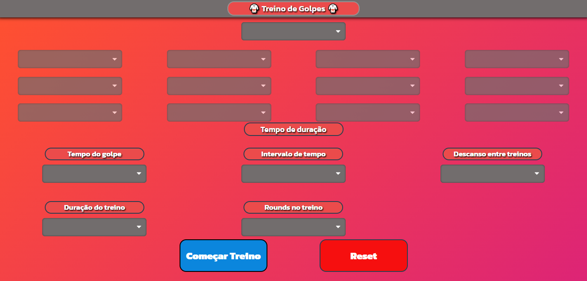

<h1 align="center" > Nervos de aço</h1>

<h1 align="center">
  
</h1>

<h2>Descrição do Projeto:</h2>

Precisando melhorar seu tempo de reação nas artes marciais? No projeto nervos de aço temos 12 opções de golpes para serem apresentados de forma aleatória em diferentes configurações de tempo para testar seu <strong> raciocínio,coordenação motora e tempo de reação.</strong>Com esta interface você tem total controle de quanto tempo seu treino irá durar,quantos rounds terão sua sessão de treinamento e quanto tempo cada golpe irá aparecer na tela,princípios estes que irão ajudar no treinamento de tempo de reação e ser um auxílio na prática de esportes no dia a dia.

## 🚀 Tecnologias utilizadas no projeto

- [HTML](https://www.w3schools.com/html/default.asp)
- [CSS](https://www.w3schools.com/css/css_intro.asp)
- [JavaScript](https://www.w3schools.com/js/default.asp)

### 💻 Features

- [x] Configuração de tempo
- [x] Interface dinâmica
- [x] Raciocínio rápido

<h4 align="center"> 
	Nervos de aço 🚀 Concluído! 
</h4>

